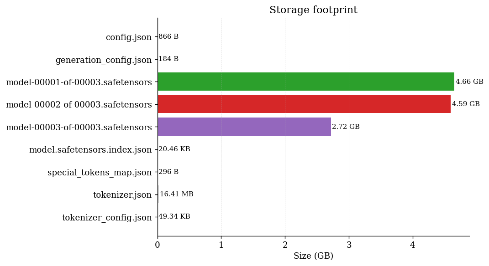
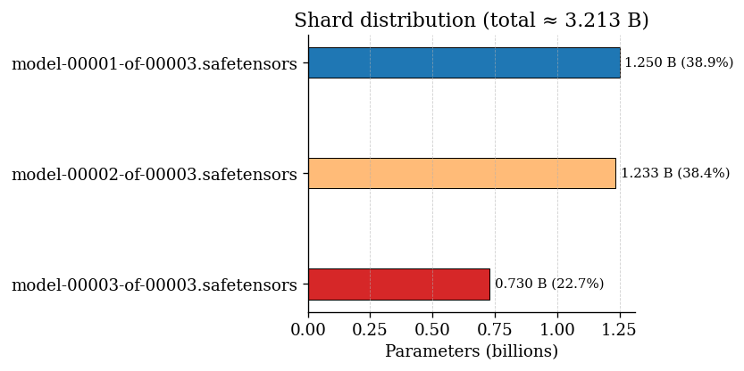

# Base Model Analysis — Llama-3.2-3B-Instruct

This README corresponds to **`base_model_visualize.ipynb`**, which analyzes the **Llama-3.2-3B-Instruct** base model.  
The goal is to visualize the model’s directory structure, storage footprint, parameter distribution, and tokenizer files before doing any IA-3, LoRA, or QLoRA work.

The notebook and the Python script inside this folder will:

- Look for the base model locally  
- **If it already exists**, it will load it directly  
- **If it does not exist**, it will download the full model and store it inside this directory  
- Generate graphs showing file sizes and parameter distribution  
- Print a clean summary of all model files  

This folder contains *only the base model analysis*. IA-3 work will be done separately.

---

## Model Summary

| Filename | Size | Parameters | Description |
|----------|------|------------|-------------|
| config.json | 866 B | – | Model architecture definition |
| generation_config.json | 184 B | – | Default generation settings |
| model-00001-of-00003.safetensors | 4.66 GB | 1,249,689,600 (~1.250 B) | Model weight shard |
| model-00002-of-00003.safetensors | 4.59 GB | 1,233,199,104 (~1.233 B) | Model weight shard |
| model-00003-of-00003.safetensors | 2.72 GB | 729,861,120 (~0.730 B) | Model weight shard |
| model.safetensors.index.json | 20.46 KB | – | Index mapping tensors to shards |
| special_tokens_map.json | 296 B | – | Special token definitions |
| tokenizer.json | 16.41 MB | – | Core tokenizer vocabulary and merge rules |
| tokenizer_config.json | 49.34 KB | – | Tokenizer configuration |

---

## Storage Footprint

Below is the chart generated by the notebook:

---

## Shard Parameter Distribution

The notebook also generates a visualization of the parameter distribution across the three safetensor shards:

---

## Notes

- The base model consists of **three safetensor shards**, each holding a portion of the parameters.  
- Tokenizer and config files are small in comparison to the weight files.  
- This reference helps when planning IA-3 insertion points later on.  

---